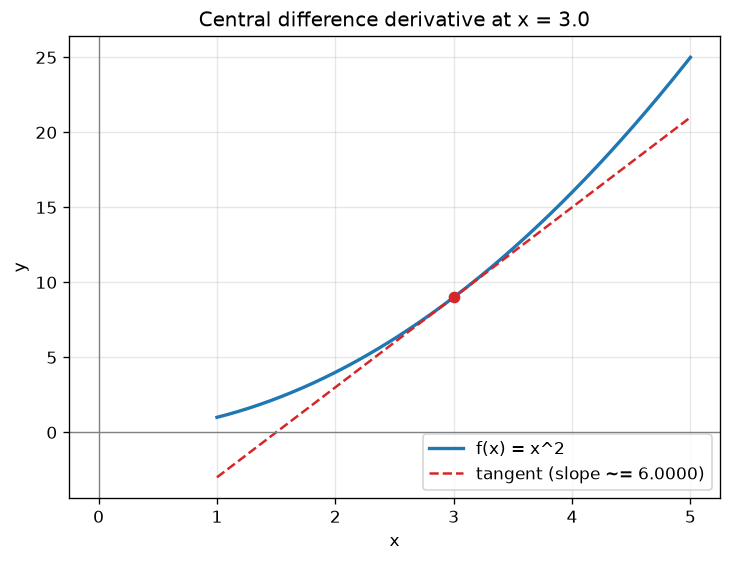
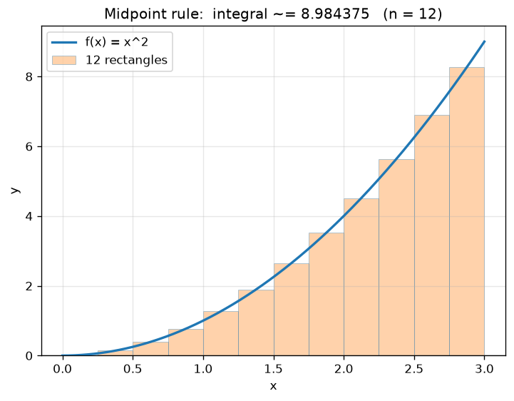
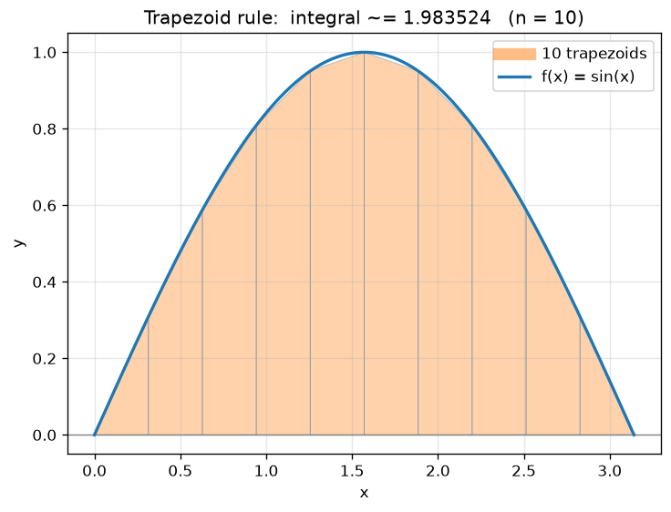
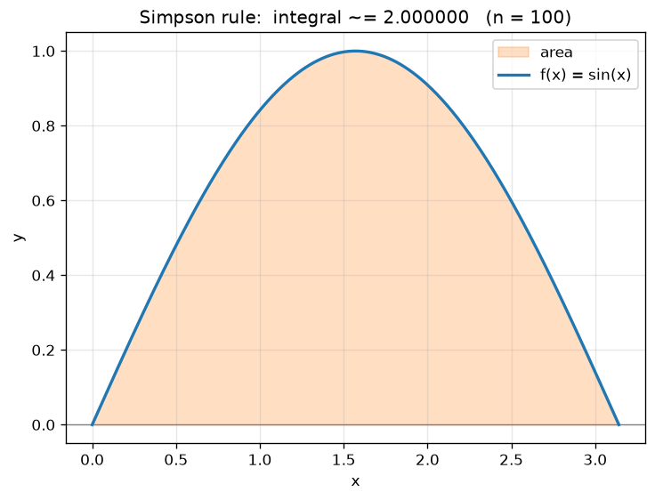

# CalcLab — sample usage

A guided tour of the CLI. Every command below is real and its output is copied verbatim from
a run. Activate your environment first (`pip install -r requirements.txt`).

---

## 1. Numerical derivatives

### The three spec examples

```console
$ python -m calclab derivative --function "x^2" --x 3 --h 0.001 --method central
CalcLab :: numerical derivative
  f(x)           = x^2
  method         = central difference
  x, h           = 3, 0.001
  approximate f' = 6
```

Pick the method with `--method forward|backward|central`. Watch the error shrink as you move
from a first-order rule to the second-order central rule (here `h = 0.1`, exact answer `6`):

```console
$ python -m calclab derivative --function "x^2" --x 3 --h 0.1 --method forward --exact 6
CalcLab :: numerical derivative
  f(x)           = x^2
  method         = forward difference
  x, h           = 3, 0.1
  approximate f' = 6.1
  exact value    = 6
  absolute error = 1.000e-01
  relative error = 1.667e-02

$ python -m calclab derivative --function "x^2" --x 3 --h 0.1 --method central --exact 6
CalcLab :: numerical derivative
  f(x)           = x^2
  method         = central difference
  x, h           = 3, 0.1
  approximate f' = 6
  exact value    = 6
  absolute error = 5.329e-15
  relative error = 8.882e-16
```

### Let SymPy supply the exact value (`--symbolic`, optional)

```console
$ python -m calclab derivative --function "sin(x)" --x 1 --method central --symbolic
CalcLab :: numerical derivative
  f(x)           = sin(x)
  method         = central difference
  x, h           = 1, 1e-05
  approximate f' = 0.5403023059
  exact value    = 0.5403023059
  absolute error = 1.114e-11
  relative error = 2.062e-11
```

### Visualize the tangent line

```console
$ python -m calclab derivative --function "x^2" --x 3 --method central --save examples/images/derivative_x2.png
CalcLab :: numerical derivative
  ...
Saved plot to examples/images/derivative_x2.png
```



---

## 2. Numerical integration

### The spec examples

```console
$ python -m calclab integrate --function "x^2" --a 0 --b 3 --n 100 --method trapezoid
CalcLab :: numerical integration
  f(x)            = x^2
  method          = trapezoid
  interval, n     = [0, 3], 100
  approximate int = 9.00045

$ python -m calclab integrate --function "sin(x)" --a 0 --b 3.14159 --n 100 --method simpson --exact 2
CalcLab :: numerical integration
  f(x)            = sin(x)
  method          = simpson
  interval, n     = [0, 3.14159], 100
  approximate int = 2.000000011
  exact value    = 2
  absolute error = 1.082e-08
  relative error = 5.410e-09
```

### Every rule on the same problem

`∫₀³ x² dx = 9`, with only `n = 10` subintervals:

```console
$ python -m calclab integrate --function "x^2" --a 0 --b 3 --n 10 --method left --exact 9
  approximate int = 7.695     absolute error = 1.305e+00

$ python -m calclab integrate --function "x^2" --a 0 --b 3 --n 10 --method right --exact 9
  approximate int = 10.395    absolute error = 1.395e+00

$ python -m calclab integrate --function "x^2" --a 0 --b 3 --n 10 --method midpoint --exact 9
  approximate int = 8.9775    absolute error = 2.250e-02

$ python -m calclab integrate --function "x^2" --a 0 --b 3 --n 10 --method trapezoid --exact 9
  approximate int = 9.045     absolute error = 4.500e-02

$ python -m calclab integrate --function "x^2" --a 0 --b 3 --n 10 --method simpson --exact 9
  approximate int = 9.0       absolute error = 1.776e-15
```

(Output trimmed to the interesting lines.) Left/right sums are crude; midpoint and trapezoid
are far better; Simpson is exact for a quadratic, down to floating-point round-off.

### Simpson requires an even `n`

```console
$ python -m calclab integrate --function "x^2" --a 0 --b 1 --n 7 --method simpson
Error: Simpson's rule requires an even number of subintervals n.
```

### Visualize the rectangles / trapezoids / area

```console
$ python -m calclab integrate --function "x^2" --a 0 --b 3 --n 12 --method midpoint --save examples/images/midpoint_x2.png
$ python -m calclab integrate --function "sin(x)" --a 0 --b 3.14159 --n 10 --method trapezoid --save examples/images/trapezoid_sin.png
$ python -m calclab integrate --function "sin(x)" --a 0 --b 3.14159 --n 100 --method simpson --save examples/images/simpson_sin.png
```

| Midpoint rectangles | Trapezoids | Simpson area |
|---|---|---|
|  |  |  |

---

## 3. Safety of the parser

CalcLab never calls `eval`. Inputs go through an AST allow-list, so injection attempts and
unknown names are rejected before anything runs:

```console
$ python -m calclab derivative --function "__import__('os').system('rm -rf /')" --x 1
Error: Only direct calls to allowed functions are permitted.

$ python -m calclab derivative --function "x.__class__" --x 1
Error: Disallowed syntax: Attribute.

$ python -m calclab integrate --function "foo(x)" --a 0 --b 1
Error: Function 'foo' is not allowed.
```

---

## 4. Use it as a library

```python
from calclab import make_function, integrate
from calclab.errors import absolute_error, relative_error

f = make_function("sin(x)")
approx = integrate(f, 0, 3.141592653589793, n=100, method="simpson")
print(f"approx         = {approx:.10f}")
print(f"absolute error = {absolute_error(approx, 2.0):.3e}")
print(f"relative error = {relative_error(approx, 2.0):.3e}")
```

```
approx         = 2.0000000108
absolute error = 1.082e-08
relative error = 5.412e-09
```
